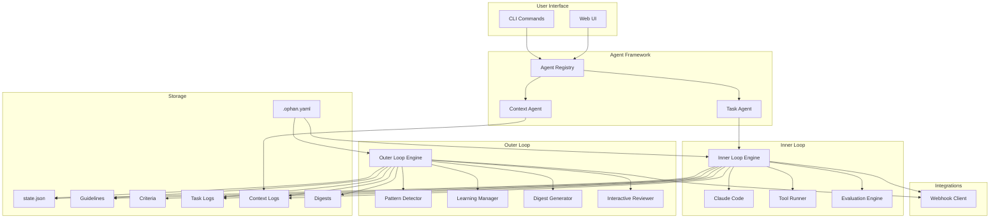
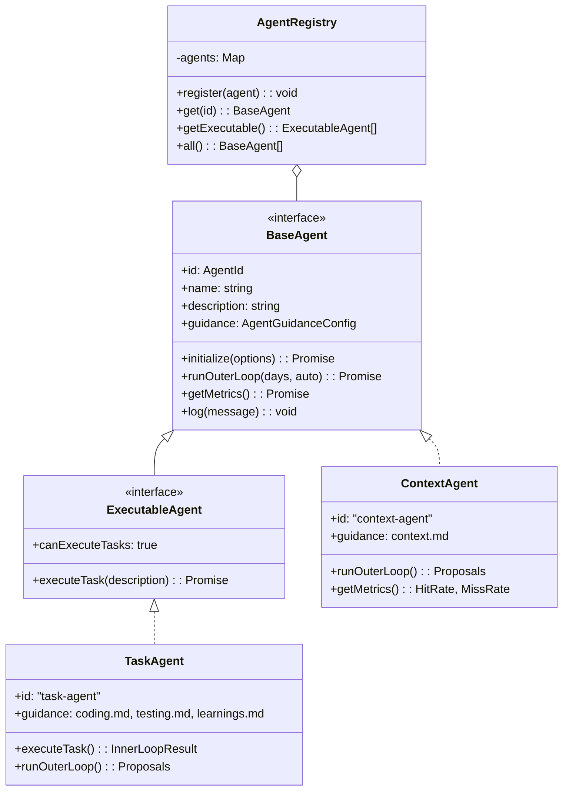
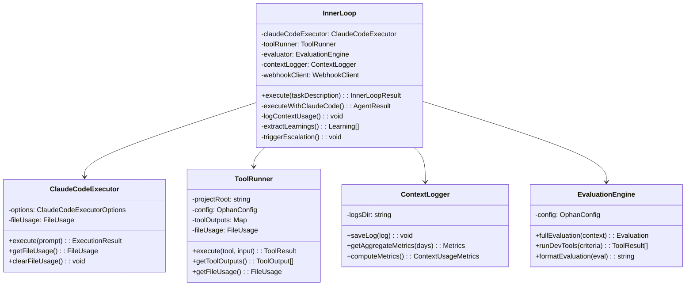
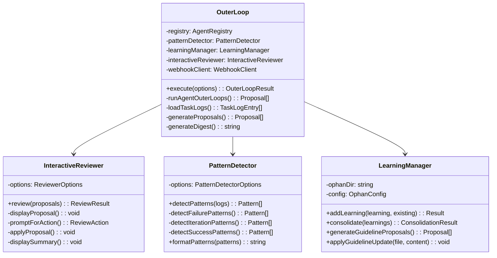

# Ophan Architecture

This document provides a comprehensive overview of Ophan's architecture, based on the Two-Loop Paradigm for self-improving AI agents.

## High-Level Architecture



## The Two-Loop Paradigm

The core innovation of Ophan is the separation of concerns between two feedback loops:


### ML Training Analogy

| ML Training | Ophan Implementation |
|-------------|---------------------|
| **Forward Pass** | Guidelines (G) → Generate output (O) |
| **Loss Function** | Criteria (C) + Dev Tools → Evaluation (E) |
| **Backpropagation** | E → Update to Guidelines (ΔG) |
| **Weight Update** | G' = G + ΔG (persistent improvement) |

## Component Architecture

### Agent Framework

Ophan uses a multi-agent architecture where each agent has its own (G,C) pair:



### Inner Loop Components



### Outer Loop Components



## Data Flow

### Task Execution Flow


### Outer Loop Review Flow


## File Structure

```
project/
├── OPHAN.md                      # Agent entry point
├── .ophan.yaml                   # Configuration
└── .ophan/
    ├── guidelines/               # Agent CAN edit
    │   ├── coding.md            # Coding workflows (Task Agent)
    │   ├── testing.md           # Testing practices (Task Agent)
    │   ├── context.md           # Context patterns (Context Agent)
    │   └── learnings.md         # Extracted learnings
    ├── criteria/                 # Agent CANNOT edit
    │   ├── quality.md           # Quality standards (Task Agent)
    │   ├── security.md          # Security requirements (Task Agent)
    │   └── context-quality.md   # Context metrics (Context Agent)
    ├── logs/                     # Task execution logs
    │   └── task-YYYYMMDD-*.json
    ├── context-logs/             # Context usage logs (Context Agent)
    │   └── task-*.json
    ├── digests/                  # Outer loop reports
    │   └── YYYY-MM-DD.md
    └── state.json                # Runtime state
```

## State Management


## Key Design Principles

### 1. Learn-Regenerate, Not Edit-Revise

The inner loop does NOT accumulate patches on flawed output:


### 2. Criteria Protection (Reward Hacking Prevention)


### 3. Expert in the Loop (EITL)

The outer loop requires external authority for criteria changes:

- **Phase 1 (Current):** Human developer reviews via Git PRs
- **Phase 2+ (Future):** Meta-cognitive agent with fixed evaluation criteria

## Integration Points

### Webhook Events


## Performance Considerations

| Component | Complexity | Notes |
|-----------|------------|-------|
| Pattern Detection | O(n²) | Signature clustering across task logs |
| Learning Similarity | O(n²) | Pairwise comparison with word overlap |
| Guideline Updates | O(1) | Append-only file operations |
| Digest Generation | O(n) | Linear scan of task logs |

## Security Model


## Next Steps

- [Inner Loop Documentation](./inner-loop.md)
- [Outer Loop Documentation](./outer-loop.md)
- [Configuration Reference](./configuration.md)
- [CLI Reference](./cli.md)
