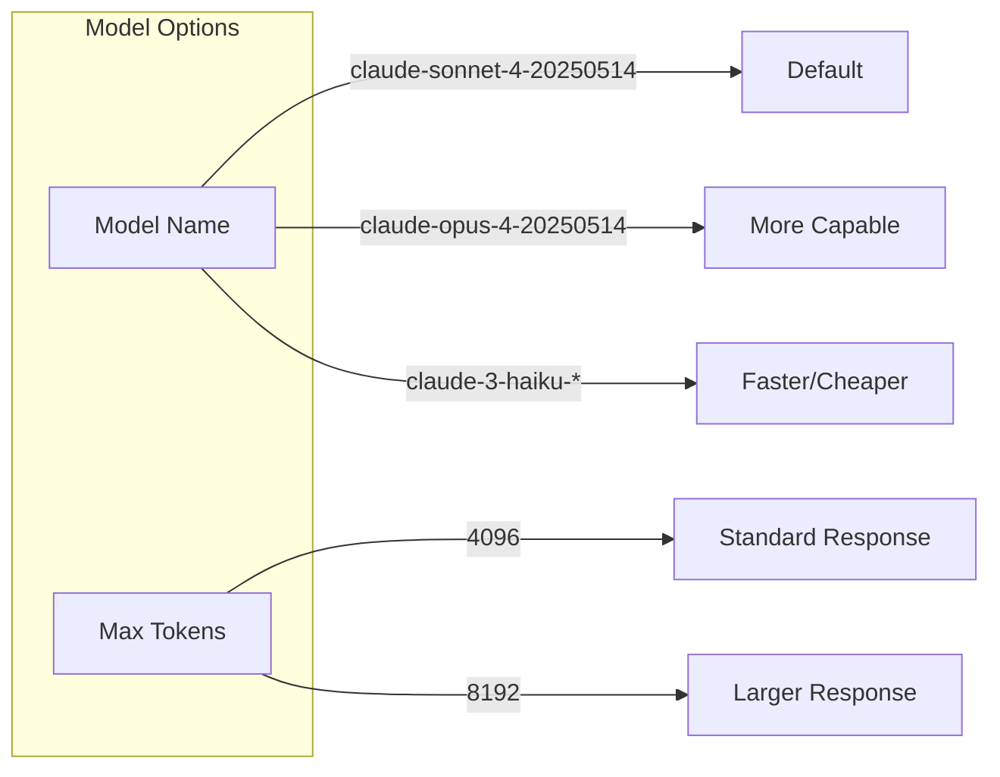
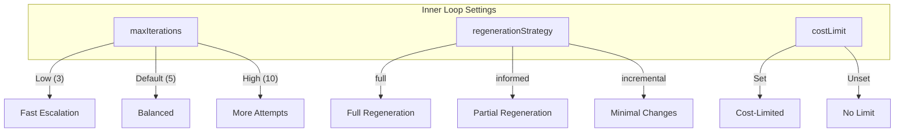
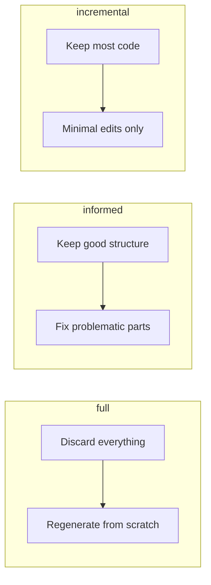
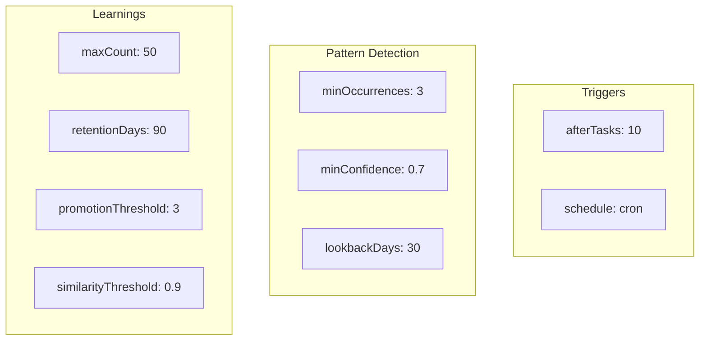
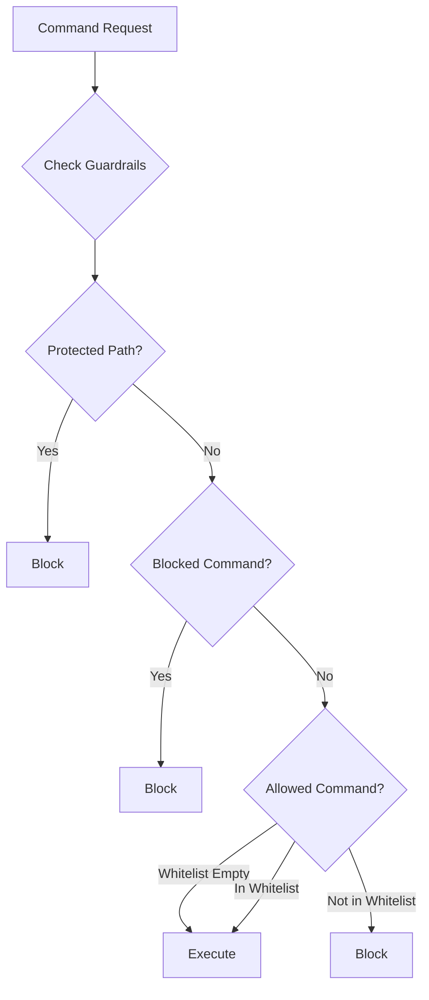
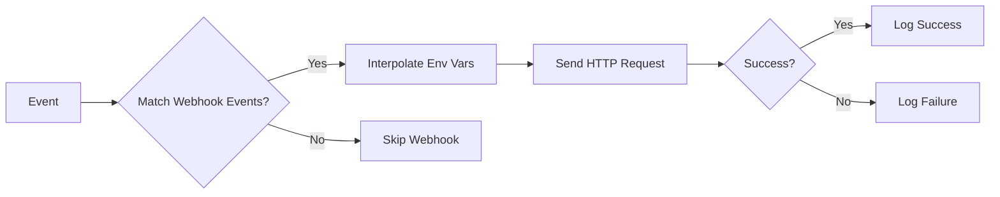
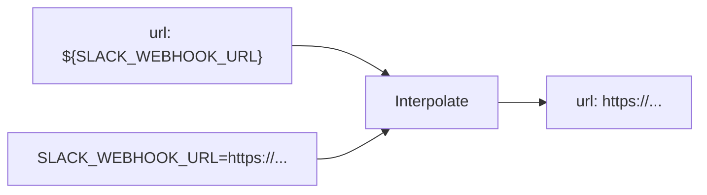
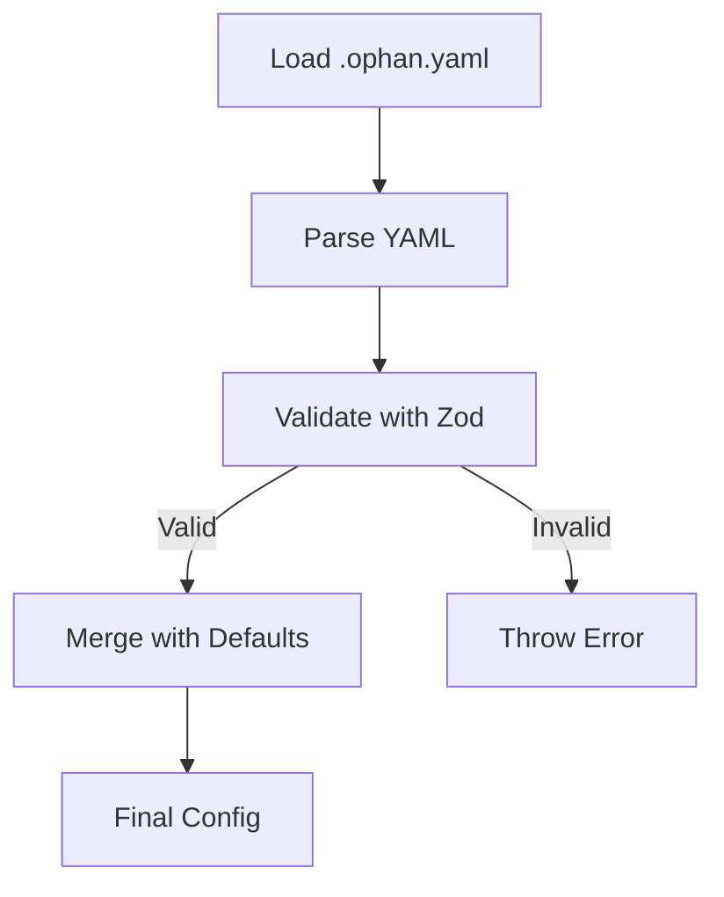

# Configuration Reference

Ophan is configured through the `.ophan.yaml` file in your project root. This document provides a complete reference of all configuration options.

## Configuration File Location

```
project/
├── .ophan.yaml          # Main configuration
├── .ophan/
│   └── state.json       # Runtime state (auto-managed)
└── ...
```

## Complete Configuration Schema

```yaml
# Model Configuration
model:
  name: claude-sonnet-4-20250514    # Claude model to use
  maxTokens: 4096                   # Max tokens per response

# Inner Loop Configuration
innerLoop:
  maxIterations: 5                  # Max iterations before escalation
  regenerationStrategy: informed    # full | informed | incremental
  costLimit: 0.50                   # Max cost per task in USD (optional)

# Outer Loop Configuration
outerLoop:
  triggers:
    afterTasks: 10                  # Run after N completed tasks
    schedule: "0 9 * * 1"           # Cron schedule (optional)

  minOccurrences: 3                 # Min occurrences for pattern
  minConfidence: 0.7                # Min confidence (0-1)
  lookbackDays: 30                  # Days of logs to analyze
  maxProposals: 5                   # Max proposals per review

  learnings:
    maxCount: 50                    # Max learnings to keep
    retentionDays: 90               # Days before pruning
    promotionThreshold: 3           # References for promotion
    similarityThreshold: 0.9        # Dedup threshold (0-1)

# Guardrails Configuration
guardrails:
  protectedPaths:                   # Paths agent cannot modify
    - ".ophan/criteria/**"
  allowedCommands: []               # Whitelist (empty = all allowed)
  blockedCommands:                  # Blacklist
    - "rm -rf /"
    - "sudo rm"

# Escalation Configuration
escalations:
  webhooks:
    - name: slack-alerts
      url: ${SLACK_WEBHOOK_URL}
      method: POST                  # POST | PUT
      headers:
        Authorization: "Bearer ${AUTH_TOKEN}"
      events:                       # escalation | task_complete | digest
        - escalation
        - digest
```

## Configuration Sections

### Model Configuration



| Option | Type | Default | Description |
|--------|------|---------|-------------|
| `model.name` | string | `claude-sonnet-4-20250514` | Claude model identifier |
| `model.maxTokens` | number | `4096` | Maximum tokens per response |

**Available Models:**

| Model | Best For | Cost |
|-------|----------|------|
| `claude-sonnet-4-20250514` | General coding tasks | $$ |
| `claude-opus-4-20250514` | Complex reasoning | $$$$ |
| `claude-3-5-haiku-*` | Simple tasks, fast | $ |

### Inner Loop Configuration



| Option | Type | Default | Description |
|--------|------|---------|-------------|
| `innerLoop.maxIterations` | number | `5` | Max iterations before escalation |
| `innerLoop.regenerationStrategy` | string | `informed` | How to regenerate on failure |
| `innerLoop.costLimit` | number | - | Max cost per task in USD |

**Regeneration Strategies:**



### Outer Loop Configuration



| Option | Type | Default | Description |
|--------|------|---------|-------------|
| `outerLoop.triggers.afterTasks` | number | `10` | Tasks before auto-review |
| `outerLoop.triggers.schedule` | string | - | Cron expression |
| `outerLoop.minOccurrences` | number | `3` | Min pattern occurrences |
| `outerLoop.minConfidence` | number | `0.7` | Min confidence (0-1) |
| `outerLoop.lookbackDays` | number | `30` | Days of logs to analyze |
| `outerLoop.maxProposals` | number | `5` | Max proposals per review |
| `outerLoop.learnings.maxCount` | number | `50` | Max learnings to keep |
| `outerLoop.learnings.retentionDays` | number | `90` | Days before pruning |
| `outerLoop.learnings.promotionThreshold` | number | `3` | References for promotion |
| `outerLoop.learnings.similarityThreshold` | number | `0.9` | Dedup threshold |

### Guardrails Configuration



| Option | Type | Default | Description |
|--------|------|---------|-------------|
| `guardrails.protectedPaths` | string[] | `[".ophan/criteria/**"]` | Glob patterns for protected files |
| `guardrails.allowedCommands` | string[] | `[]` | Command whitelist (empty = all) |
| `guardrails.blockedCommands` | string[] | `["rm -rf /", "sudo rm"]` | Command blacklist |

### Escalation Configuration



| Option | Type | Description |
|--------|------|-------------|
| `escalations.webhooks[].name` | string | Webhook identifier |
| `escalations.webhooks[].url` | string | Webhook URL (supports `${ENV_VAR}`) |
| `escalations.webhooks[].method` | string | HTTP method: `POST` or `PUT` |
| `escalations.webhooks[].headers` | object | Custom headers (supports `${ENV_VAR}`) |
| `escalations.webhooks[].events` | string[] | Events to trigger: `escalation`, `task_complete`, `digest` |

## Environment Variable Interpolation

Configuration values can reference environment variables using `${VAR_NAME}` syntax:

```yaml
escalations:
  webhooks:
    - name: slack
      url: ${SLACK_WEBHOOK_URL}          # Required env var
      headers:
        Authorization: Bearer ${API_KEY}  # Optional auth
```



**Required Environment Variables:**

| Variable | Required | Description |
|----------|----------|-------------|
| `ANTHROPIC_API_KEY` | Yes | Anthropic API key for Claude |
| Webhook URLs/tokens | No | As referenced in config |

## Default Configuration

If no `.ophan.yaml` exists, these defaults are used:

```yaml
model:
  name: claude-sonnet-4-20250514
  maxTokens: 4096

innerLoop:
  maxIterations: 5
  regenerationStrategy: informed

outerLoop:
  triggers:
    afterTasks: 10
  minOccurrences: 3
  minConfidence: 0.7
  lookbackDays: 30
  maxProposals: 5
  learnings:
    maxCount: 50
    retentionDays: 90
    promotionThreshold: 3
    similarityThreshold: 0.9

guardrails:
  protectedPaths:
    - ".ophan/criteria/**"
  allowedCommands: []
  blockedCommands:
    - "rm -rf /"
    - "sudo rm"
```

## Configuration Examples

### Minimal Configuration

```yaml
# Use all defaults, just set cost limit
innerLoop:
  costLimit: 1.00
```

### High-Quality Mode

```yaml
model:
  name: claude-opus-4-20250514
  maxTokens: 8192

innerLoop:
  maxIterations: 10
  regenerationStrategy: full
  costLimit: 5.00
```

### Fast/Cheap Mode

```yaml
model:
  name: claude-3-5-haiku-latest
  maxTokens: 2048

innerLoop:
  maxIterations: 3
  regenerationStrategy: incremental
  costLimit: 0.10
```

### Full Webhook Configuration

```yaml
escalations:
  webhooks:
    # Slack for all events
    - name: slack-general
      url: ${SLACK_GENERAL_WEBHOOK}
      events: [escalation, task_complete, digest]

    # PagerDuty for critical only
    - name: pagerduty
      url: https://events.pagerduty.com/v2/enqueue
      headers:
        Authorization: Token ${PAGERDUTY_TOKEN}
        Content-Type: application/json
      events: [escalation]

    # Custom API
    - name: metrics-api
      url: ${METRICS_API_URL}/ophan/events
      method: PUT
      headers:
        X-API-Key: ${METRICS_API_KEY}
      events: [task_complete]
```

## Validation

Configuration is validated using Zod schemas at load time:



**Common Validation Errors:**

| Error | Cause | Fix |
|-------|-------|-----|
| `Invalid model name` | Unknown model ID | Use valid Claude model |
| `maxIterations must be positive` | Zero or negative value | Set to >= 1 |
| `minConfidence must be 0-1` | Value outside range | Use decimal 0.0-1.0 |
| `Invalid webhook URL` | Malformed URL | Check URL format |

## Next Steps

- [Architecture Overview](./architecture.md) - System architecture
- [Inner Loop Documentation](./inner-loop.md) - Task execution details
- [Outer Loop Documentation](./outer-loop.md) - Pattern detection details
