# Inner Loop Documentation

The inner loop is Ophan's per-task execution engine. It implements the learn-regenerate paradigm where the agent generates output, evaluates it, learns from failures, and regenerates with improved understanding.

## Overview

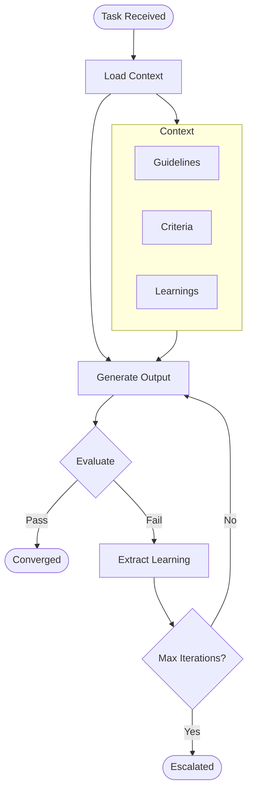

## Execution Flow

### 1. Task Initialization

When a task is submitted, the inner loop:

1. Generates a unique task ID
2. Loads guidelines, criteria, and learnings
3. Initializes the Claude client with tools
4. Sets up the evaluation engine

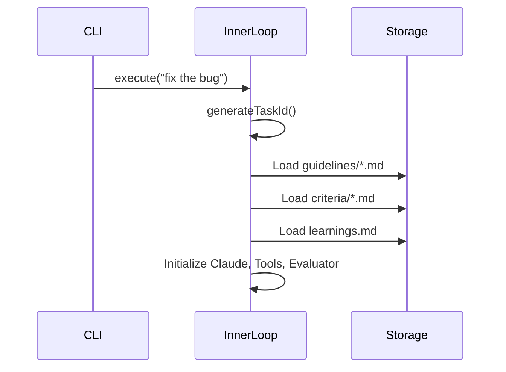

### 2. Agent Loop

The agent loop executes Claude Code with tools until completion:

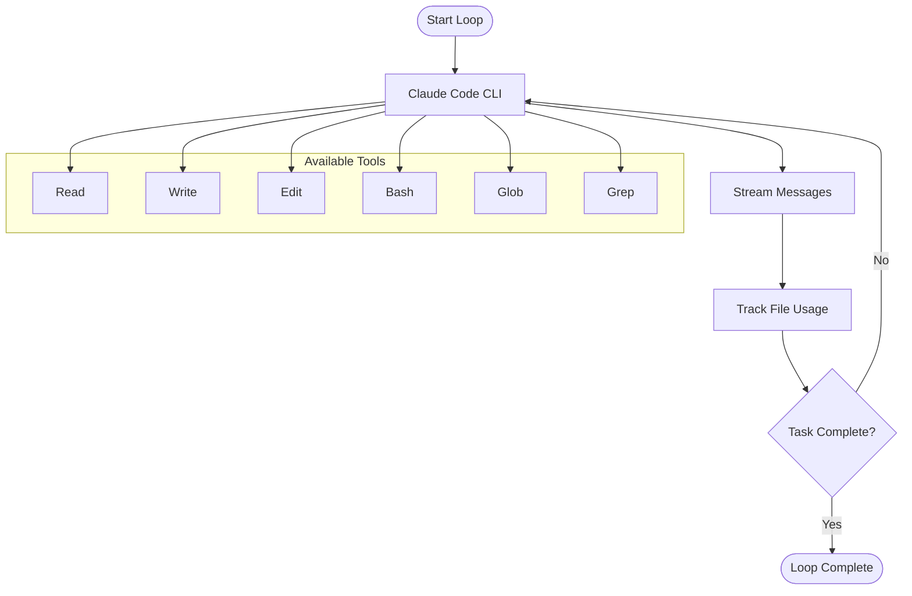

Ophan uses Claude Code (subscription-based) for task execution:
- No API key required (uses Claude Code subscription)
- Full tool access via Claude Code's built-in tools
- File usage is tracked for context agent evaluation
- Cost limits enforced via Claude Code's budget system

### 3. Tool Execution

Tools are executed in a sandboxed environment:

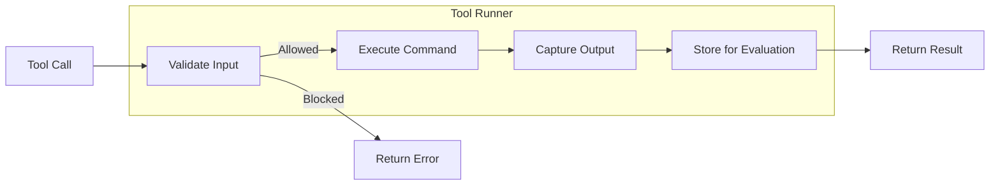

**Tool Types:**

| Tool | Purpose | Sandboxed |
|------|---------|-----------|
| `read_file` | Read file contents | Yes (path validation) |
| `write_file` | Create/modify files | Yes (protected paths) |
| `run_shell` | Execute commands | Yes (blocklist) |
| `search_code` | Search codebase | Yes (project scope) |
| `task_complete` | Signal completion | N/A |

### 4. Evaluation

After each iteration, the output is evaluated:

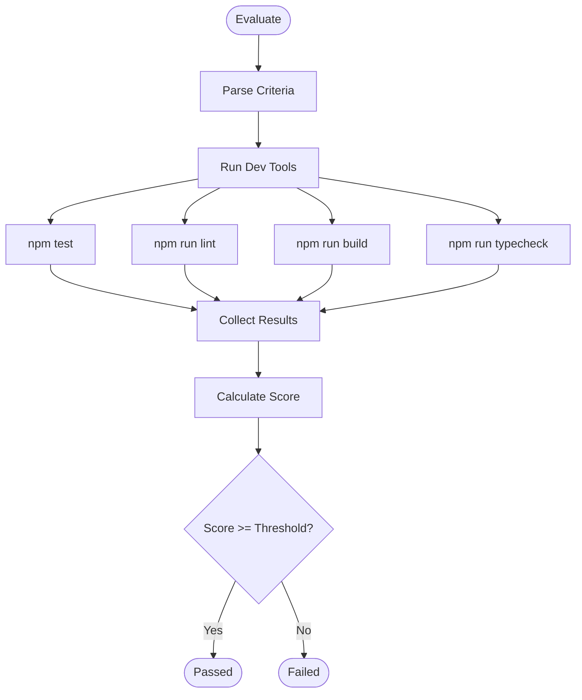

**Evaluation Criteria:**

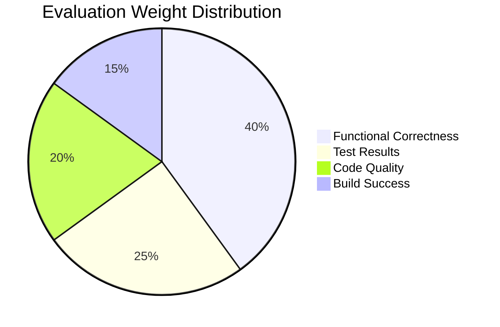

### 5. Learning Extraction

When evaluation fails, learnings are extracted:

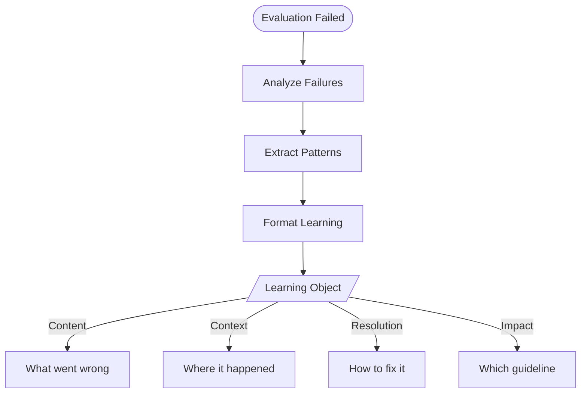

**Learning Structure:**

```typescript
interface Learning {
  id: string;              // Unique identifier
  content: string;         // The learning itself
  context: string;         // Task context
  issue: string;           // What went wrong
  resolution: string;      // How it was fixed
  guidelineImpact: string; // Which guideline to update
  timestamp: string;       // When extracted
  references: number;      // Times referenced
  promoted: boolean;       // Promoted to guideline?
}
```

### 6. Regeneration Strategies

Ophan supports three regeneration strategies:

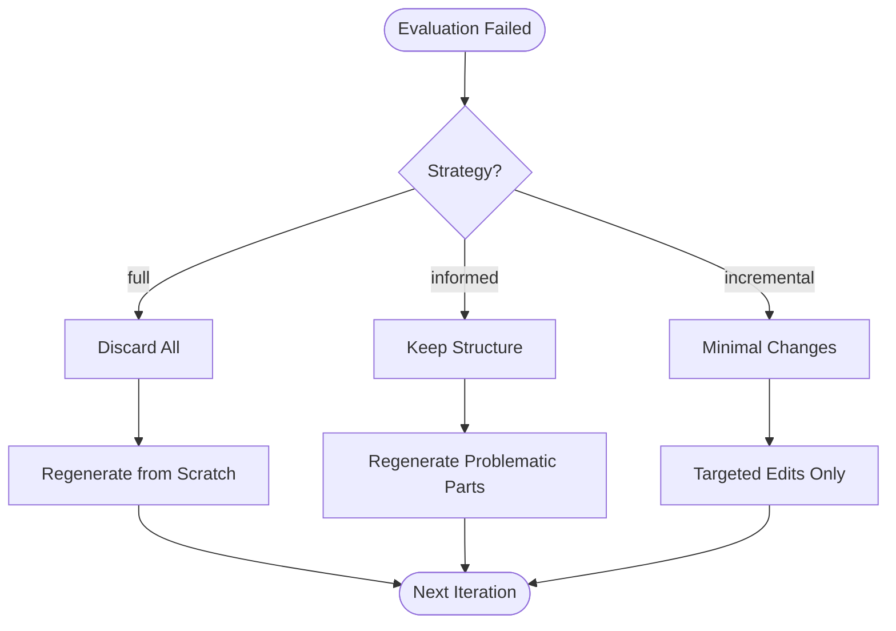

| Strategy | Description | Best For |
|----------|-------------|----------|
| `full` | Discard output, regenerate from scratch | Small tasks, creative work |
| `informed` | Keep structurally sound parts, regenerate problems | Most coding tasks (default) |
| `incremental` | Minimal targeted edits | Quick fixes, minor adjustments |

### 7. Convergence & Escalation

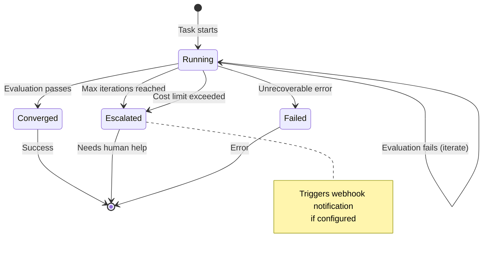

## Cost Management

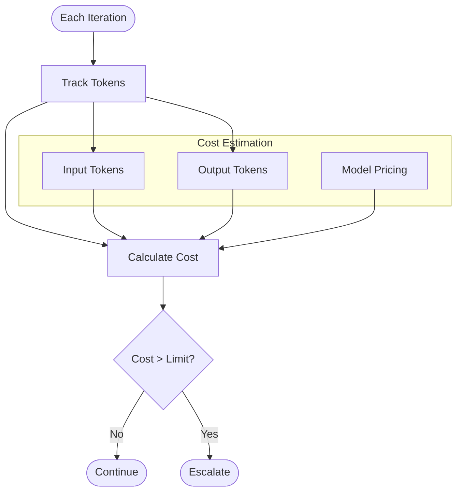

**Cost Formula:**

```
cost = (inputTokens * inputPrice) + (outputTokens * outputPrice)

For Claude Sonnet:
- inputPrice = $3.00 / 1M tokens
- outputPrice = $15.00 / 1M tokens
```

## Task Logging

Every task execution is logged for the outer loop:

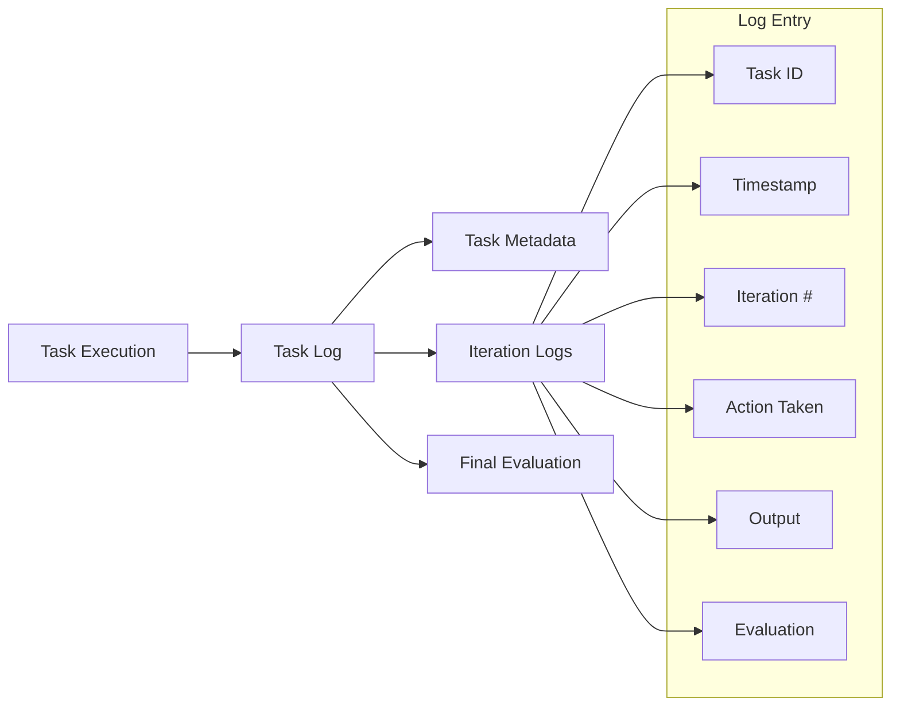

## Context Usage Logging

After each task, the inner loop logs context usage for the Context Agent:

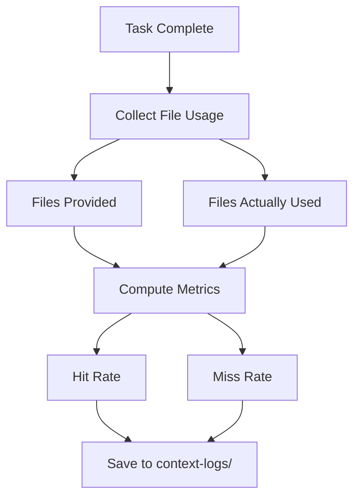

**Context Usage Metrics:**

| Metric | Description | Target |
|--------|-------------|--------|
| Hit Rate | % of provided files that were used | >70% |
| Miss Rate | % of used files that weren't provided | <20% |
| Exploration Tokens | Tokens spent on discovery before first write | Minimize |

This data enables the Context Agent to learn which files are relevant for different task types.

## System Prompt Structure

The system prompt is dynamically built for each iteration:

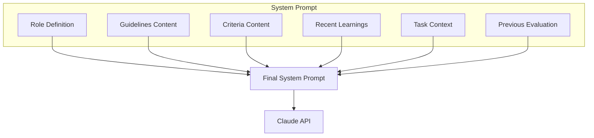

## Error Handling

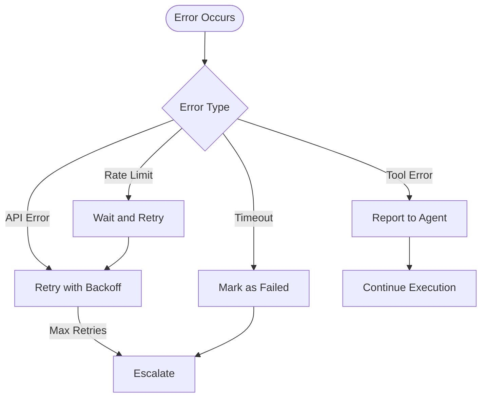

## Configuration Options

```yaml
innerLoop:
  maxIterations: 5           # Maximum iterations before escalation
  regenerationStrategy: informed  # full | informed | incremental
  costLimit: 0.50            # Maximum cost per task in USD

# Claude Code configuration
claudeCode:
  allowedTools:              # Tools to allow (omit for all)
    - Read
    - Write
    - Edit
    - Bash
    - Glob
    - Grep
  maxTurns: 50               # Max conversation turns
```

## Metrics Tracked

| Metric | Description |
|--------|-------------|
| `iterations` | Number of iterations used |
| `tokensUsed` | Total tokens consumed |
| `cost` | Estimated cost in USD |
| `duration` | Time to completion |
| `status` | converged / escalated / failed |

## Next Steps

- [Outer Loop Documentation](./outer-loop.md) - Pattern detection and learning consolidation
- [Configuration Reference](./configuration.md) - Full configuration options
- [Architecture Overview](./architecture.md) - System architecture
