# Outer Loop Documentation

The outer loop is Ophan's periodic review engine. It analyzes task logs to detect patterns, consolidates learnings, and proposes updates to guidelines and criteria.

## Overview

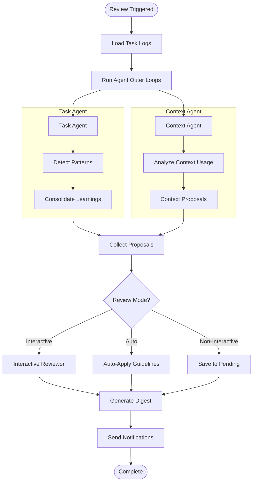
```mermaid
flowchart TB
    Start([Review Triggered]) --> Load[Load Task Logs]
    Load --> Agents[Run Agent Outer Loops]
    Agents --> TA[Task Agent]
    Agents --> CA[Context Agent]
    TA --> Patterns[Detect Patterns]
    CA --> CtxMetrics[Analyze Context Usage]
    Patterns --> Consolidate[Consolidate Learnings]
    CtxMetrics --> CtxProposals[Context Proposals]
    Consolidate --> AllProposals[Collect Proposals]
    CtxProposals --> AllProposals
    AllProposals --> Review{Review Mode?}
    Review --> |"Interactive"| IR[Interactive Reviewer]
    Review --> |"Auto"| AutoApply[Auto-Apply Guidelines]
    Review --> |"Non-Interactive"| Pending[Save to Pending]
    IR --> Digest[Generate Digest]
    AutoApply --> Digest
    Pending --> Digest
    Digest --> Notify[Send Notifications]
    Notify --> Done([Complete])

    subgraph "Task Agent"
        TA
        Patterns
        Consolidate
    end

    subgraph "Context Agent"
        CA
        CtxMetrics
        CtxProposals
    end
```

## Multi-Agent Outer Loop

The outer loop runs each registered agent's analysis in sequence:

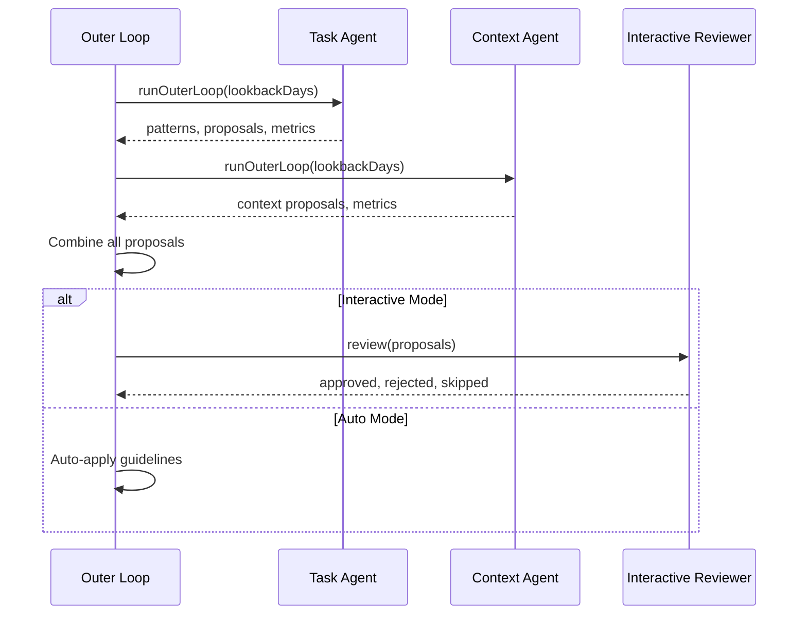
```mermaid
sequenceDiagram
    participant OL as Outer Loop
    participant TA as Task Agent
    participant CA as Context Agent
    participant IR as Interactive Reviewer

    OL->>TA: runOuterLoop(lookbackDays)
    TA-->>OL: patterns, proposals, metrics

    OL->>CA: runOuterLoop(lookbackDays)
    CA-->>OL: context proposals, metrics

    OL->>OL: Combine all proposals

    alt Interactive Mode
        OL->>IR: review(proposals)
        IR-->>OL: approved, rejected, skipped
    else Auto Mode
        OL->>OL: Auto-apply guidelines
    end
```

**Agent Contributions:**

| Agent | Analyzes | Proposes |
|-------|----------|----------|
| Task Agent | Task logs, patterns, learnings | Coding/testing guidelines, criteria |
| Context Agent | Context usage metrics | Context guidelines, context-quality criteria |

## Triggering the Outer Loop

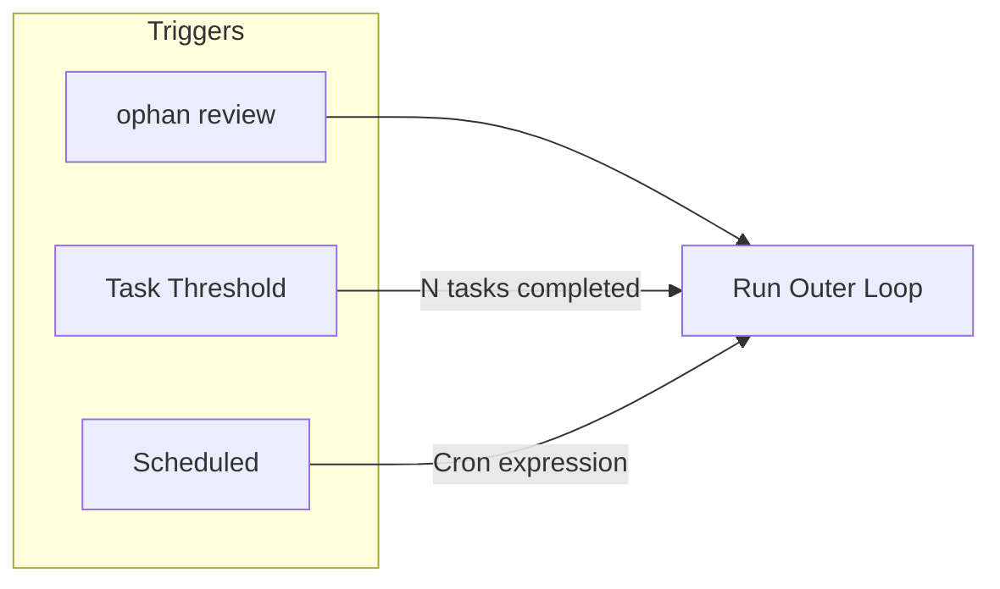
```mermaid
flowchart LR
    subgraph "Triggers"
        Manual[ophan review]
        Threshold[Task Threshold]
        Schedule[Scheduled]
    end

    Manual --> Review[Run Outer Loop]
    Threshold --> |"N tasks completed"| Review
    Schedule --> |"Cron expression"| Review
```

**Configuration:**

```yaml
outerLoop:
  triggers:
    afterTasks: 10        # Run after N completed tasks
    schedule: "0 9 * * 1" # Optional: cron schedule (Monday 9am)
```

## Pattern Detection

The pattern detector analyzes task logs to identify recurring issues and successes.

### Pattern Types

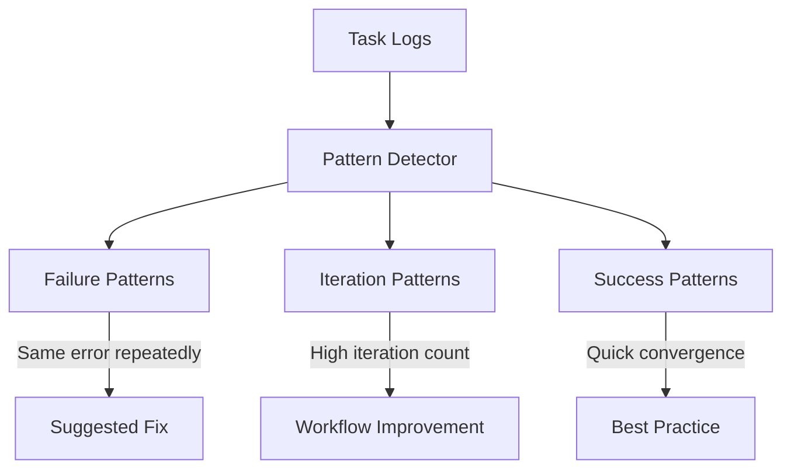
```mermaid
flowchart TB
    Logs[Task Logs] --> Detector[Pattern Detector]

    Detector --> Failure[Failure Patterns]
    Detector --> Iteration[Iteration Patterns]
    Detector --> Success[Success Patterns]

    Failure --> |"Same error repeatedly"| FA[Suggested Fix]
    Iteration --> |"High iteration count"| IA[Workflow Improvement]
    Success --> |"Quick convergence"| SA[Best Practice]
```

### Failure Pattern Detection

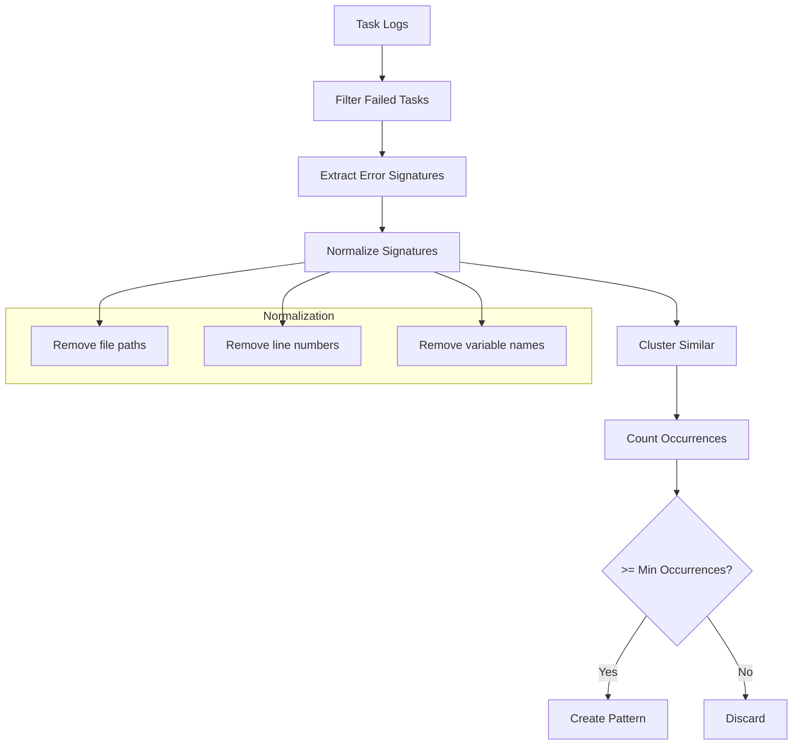
```mermaid
flowchart TB
    Logs[Task Logs] --> Filter[Filter Failed Tasks]
    Filter --> Extract[Extract Error Signatures]
    Extract --> Normalize[Normalize Signatures]
    Normalize --> Cluster[Cluster Similar]
    Cluster --> Count[Count Occurrences]
    Count --> Threshold{>= Min Occurrences?}
    Threshold --> |"Yes"| Pattern[Create Pattern]
    Threshold --> |"No"| Discard[Discard]

    subgraph "Normalization"
        RemovePaths[Remove file paths]
        RemoveLines[Remove line numbers]
        RemoveNames[Remove variable names]
    end

    Normalize --> RemovePaths
    Normalize --> RemoveLines
    Normalize --> RemoveNames
```

**Example Failure Signatures:**

| Raw Error | Normalized Signature |
|-----------|---------------------|
| `TypeError at /src/utils.ts:42` | `typeerror at <path>:line <n>` |
| `Test failed: expected 200, got 401` | `test failed: expected <n>, got <n>` |
| `Cannot find module 'lodash'` | `cannot find module '<name>'` |

### Iteration Pattern Detection

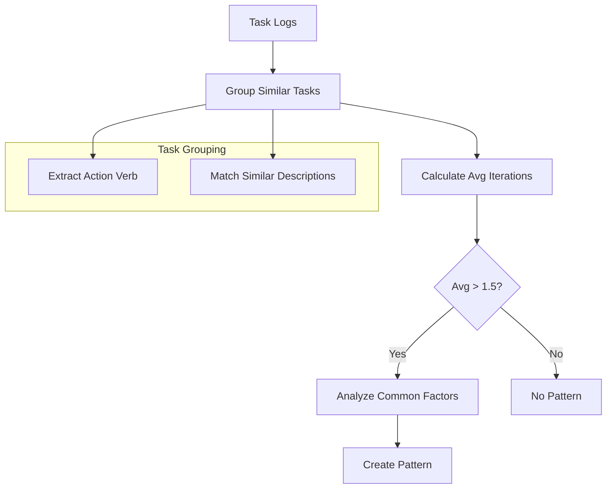
```mermaid
flowchart TB
    Logs[Task Logs] --> Group[Group Similar Tasks]
    Group --> Avg[Calculate Avg Iterations]
    Avg --> Check{Avg > 1.5?}
    Check --> |"Yes"| Analyze[Analyze Common Factors]
    Analyze --> Pattern[Create Pattern]
    Check --> |"No"| OK[No Pattern]

    subgraph "Task Grouping"
        Extract[Extract Action Verb]
        Match[Match Similar Descriptions]
    end

    Group --> Extract
    Group --> Match
```

### Success Pattern Detection

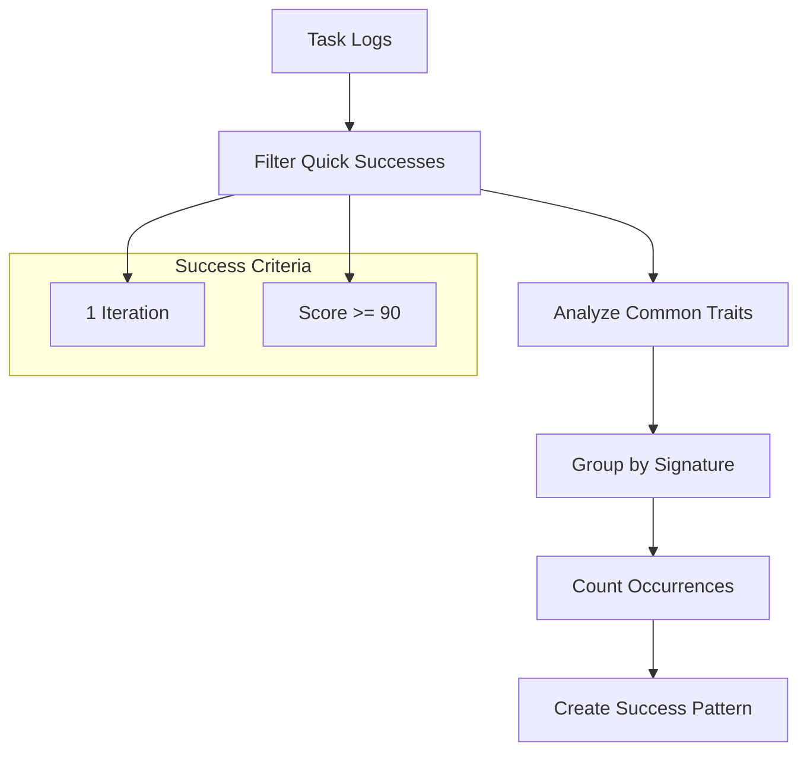
```mermaid
flowchart TB
    Logs[Task Logs] --> Filter[Filter Quick Successes]
    Filter --> Analyze[Analyze Common Traits]
    Analyze --> Group[Group by Signature]
    Group --> Count[Count Occurrences]
    Count --> Pattern[Create Success Pattern]

    subgraph "Success Criteria"
        OneIter[1 Iteration]
        HighScore[Score >= 90]
    end

    Filter --> OneIter
    Filter --> HighScore
```

### Pattern Confidence

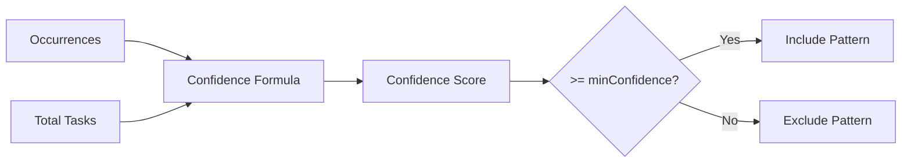
```mermaid
flowchart LR
    Occurrences[Occurrences] --> Formula[Confidence Formula]
    TotalTasks[Total Tasks] --> Formula
    Formula --> Confidence[Confidence Score]

    Confidence --> Threshold{>= minConfidence?}
    Threshold --> |"Yes"| Include[Include Pattern]
    Threshold --> |"No"| Exclude[Exclude Pattern]
```

**Confidence Formula:**

```
confidence = min(1.0, occurrences / totalTasks)
```

## Learning Consolidation

The learning manager handles deduplication, promotion, and pruning of learnings.

### Consolidation Flow

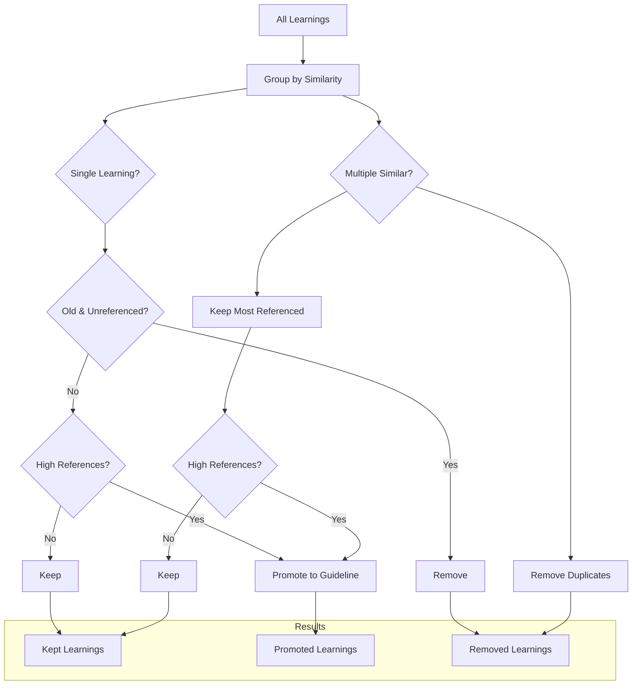
```mermaid
flowchart TB
    Learnings[All Learnings] --> Group[Group by Similarity]

    Group --> Single{Single Learning?}
    Group --> Multiple{Multiple Similar?}

    Single --> Age{Old & Unreferenced?}
    Age --> |"Yes"| Remove1[Remove]
    Age --> |"No"| Promote1{High References?}
    Promote1 --> |"Yes"| Promote[Promote to Guideline]
    Promote1 --> |"No"| Keep1[Keep]

    Multiple --> Best[Keep Most Referenced]
    Best --> Promote2{High References?}
    Promote2 --> |"Yes"| Promote
    Promote2 --> |"No"| Keep2[Keep]
    Multiple --> Remove2[Remove Duplicates]

    subgraph "Results"
        Kept[Kept Learnings]
        Promoted[Promoted Learnings]
        Removed[Removed Learnings]
    end

    Keep1 --> Kept
    Keep2 --> Kept
    Promote --> Promoted
    Remove1 --> Removed
    Remove2 --> Removed
```

### Similarity Detection

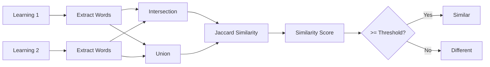
```mermaid
flowchart LR
    L1[Learning 1] --> Words1[Extract Words]
    L2[Learning 2] --> Words2[Extract Words]

    Words1 --> Intersect[Intersection]
    Words2 --> Intersect
    Words1 --> Union[Union]
    Words2 --> Union

    Intersect --> Formula[Jaccard Similarity]
    Union --> Formula

    Formula --> Score[Similarity Score]
    Score --> Check{>= Threshold?}
    Check --> |"Yes"| Similar[Similar]
    Check --> |"No"| Different[Different]
```

**Similarity Formula (Jaccard Index):**

```
similarity = |words1 ∩ words2| / |words1 ∪ words2|
```

### Promotion Criteria

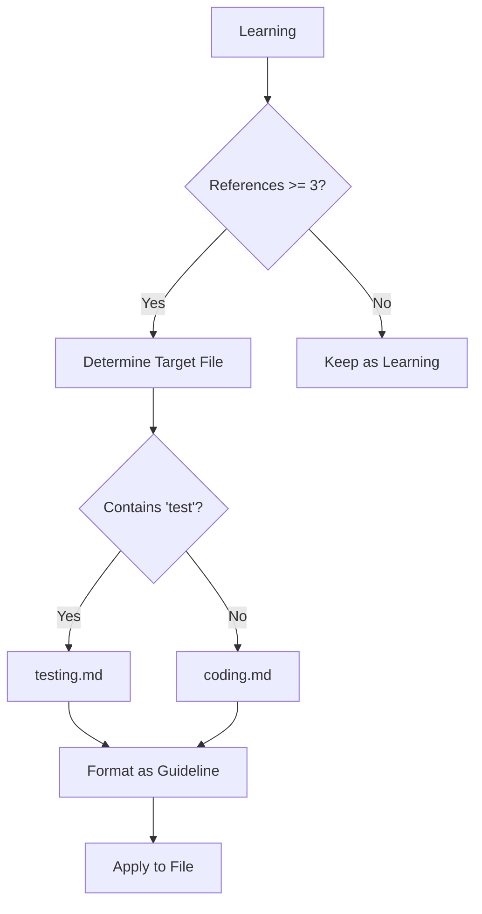
```mermaid
flowchart TB
    Learning[Learning] --> Check{References >= 3?}
    Check --> |"Yes"| Target[Determine Target File]
    Check --> |"No"| Keep[Keep as Learning]

    Target --> Test{Contains 'test'?}
    Test --> |"Yes"| Testing[testing.md]
    Test --> |"No"| Coding[coding.md]

    Testing --> Format[Format as Guideline]
    Coding --> Format
    Format --> Apply[Apply to File]
```

### Retention Policy

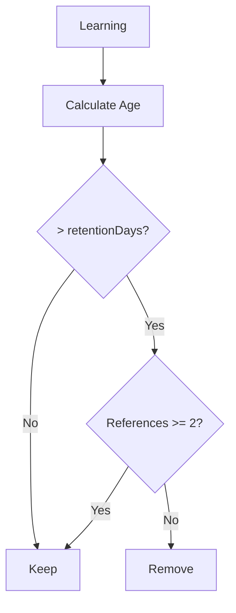
```mermaid
flowchart TB
    Learning[Learning] --> Age[Calculate Age]
    Age --> Old{> retentionDays?}
    Old --> |"Yes"| Refs{References >= 2?}
    Refs --> |"Yes"| Keep[Keep]
    Refs --> |"No"| Remove[Remove]
    Old --> |"No"| Keep
```

**Configuration:**

```yaml
outerLoop:
  learnings:
    maxCount: 50              # Maximum learnings to keep
    retentionDays: 90         # Remove learnings older than this
    promotionThreshold: 3     # Promote after N references
    similarityThreshold: 0.9  # Deduplication threshold
```

## Proposal Generation

### Guideline vs Criteria Updates

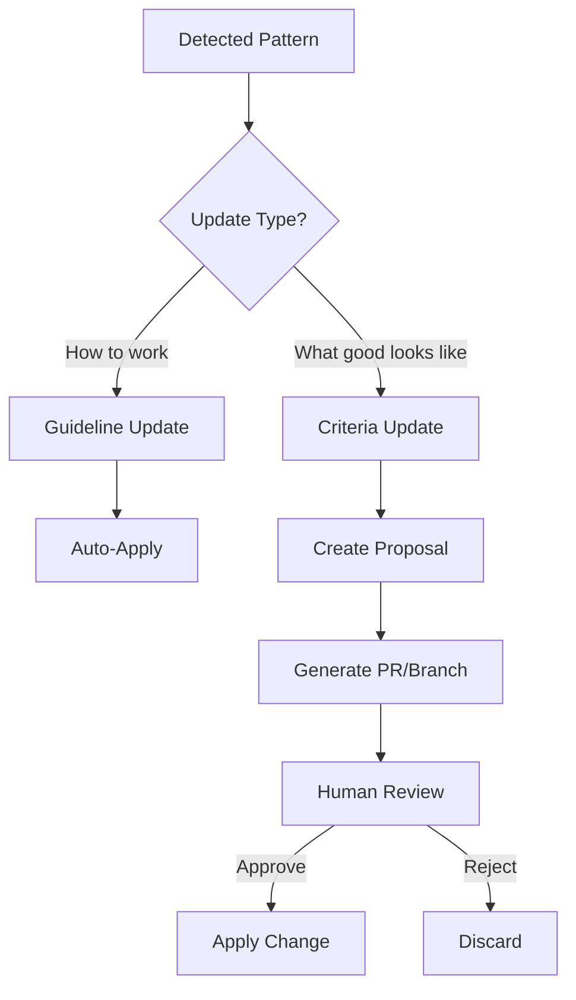
```mermaid
flowchart TB
    Pattern[Detected Pattern] --> Type{Update Type?}

    Type --> |"How to work"| Guideline[Guideline Update]
    Type --> |"What good looks like"| Criteria[Criteria Update]

    Guideline --> Auto[Auto-Apply]
    Criteria --> Proposal[Create Proposal]

    Proposal --> PR[Generate PR/Branch]
    PR --> Human[Human Review]
    Human --> |"Approve"| Apply[Apply Change]
    Human --> |"Reject"| Discard[Discard]
```

### Proposal Structure

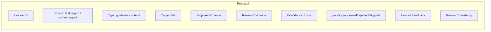
```mermaid
flowchart LR
    subgraph "Proposal"
        ID[Unique ID]
        Source[Source: task-agent / context-agent]
        Type[Type: guideline / criteria]
        Target[Target File]
        Change[Proposed Change]
        Reason[Reason/Evidence]
        Confidence[Confidence Score]
        Status[pending/approved/rejected/skipped]
        Feedback[Human Feedback]
        ReviewedAt[Review Timestamp]
    end
```

**Proposal Fields:**

| Field | Description |
|-------|-------------|
| `id` | Unique identifier |
| `source` | Which agent generated this (`task-agent` or `context-agent`) |
| `type` | `guideline` (auto-approvable) or `criteria` (requires human) |
| `targetFile` | File to modify (e.g., `guidelines/coding.md`) |
| `change` | The proposed content (may include `APPEND:`, `REPLACE:`, `PREPEND:`) |
| `reason` | Why this change is suggested |
| `confidence` | 0-1 score based on evidence |
| `status` | `pending`, `approved`, `rejected`, or `skipped` |
| `humanFeedback` | Notes from reviewer (if rejected or edited) |
| `reviewedAt` | When the proposal was reviewed |

## Digest Generation

The digest is a comprehensive report of the review:

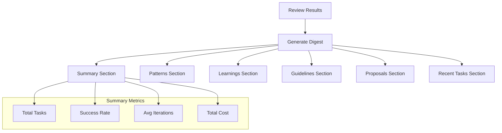
```mermaid
flowchart TB
    Review[Review Results] --> Digest[Generate Digest]

    Digest --> Summary[Summary Section]
    Digest --> Patterns[Patterns Section]
    Digest --> Learnings[Learnings Section]
    Digest --> Guidelines[Guidelines Section]
    Digest --> Proposals[Proposals Section]
    Digest --> Tasks[Recent Tasks Section]

    subgraph "Summary Metrics"
        Total[Total Tasks]
        Success[Success Rate]
        Iterations[Avg Iterations]
        Cost[Total Cost]
    end

    Summary --> Total
    Summary --> Success
    Summary --> Iterations
    Summary --> Cost
```

**Example Digest:**

```markdown
# Ophan Review Digest

**Generated:** 2024-01-15T10:30:00Z
**Lookback Period:** 30 days
**Tasks Analyzed:** 47

## Summary

| Metric | Value |
|--------|-------|
| Total Tasks | 47 |
| Successful | 41 (87.2%) |
| Failed | 4 |
| Escalated | 2 |
| Avg Iterations | 2.3 |
| Total Cost | $12.45 |

## Patterns Detected

### Failure Patterns
- **TypeScript type errors** (8 occurrences, 85% confidence)
  - Suggested: Update coding.md - Add reminder to run type checking

### Success Patterns
- **Quick convergence: create simple** (12 tasks, 100% confidence)

## Learnings Consolidation
- **Kept:** 23
- **Promoted to Guidelines:** 5
- **Removed (duplicates/old):** 8

## Guidelines Updated
- coding.md
- testing.md

## Pending Proposals
No proposals generated.

## Recent Tasks
- **task-20240115-103000-abc1** - converged (1 iter, $0.26)
  fix the login validation bug
- **task-20240114-143000-def2** - escalated (5 iter, $1.30)
  implement user authentication system
```

## Webhook Notifications

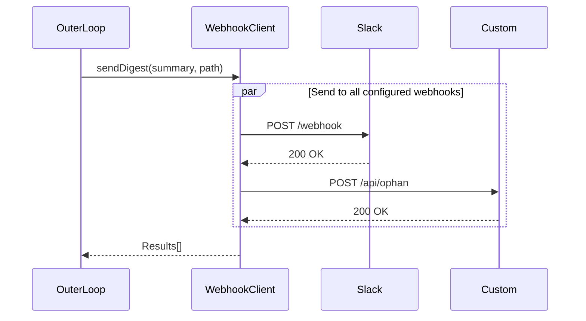
```mermaid
sequenceDiagram
    participant OuterLoop
    participant WebhookClient
    participant Slack
    participant Custom

    OuterLoop->>WebhookClient: sendDigest(summary, path)

    par Send to all configured webhooks
        WebhookClient->>Slack: POST /webhook
        Slack-->>WebhookClient: 200 OK

        WebhookClient->>Custom: POST /api/ophan
        Custom-->>WebhookClient: 200 OK
    end

    WebhookClient-->>OuterLoop: Results[]
```

**Digest Webhook Payload:**

```json
{
  "type": "digest",
  "timestamp": "2024-01-15T10:30:00Z",
  "summary": {
    "totalTasks": 47,
    "successfulTasks": 41,
    "failedTasks": 4,
    "escalatedTasks": 2,
    "patternsDetected": 3,
    "learningsPromoted": 5
  },
  "digestPath": "/path/to/.ophan/digests/2024-01-15.md",
  "project": {
    "name": "my-app",
    "path": "/Users/dev/my-app"
  }
}
```

## State Updates

After the review, state is updated:

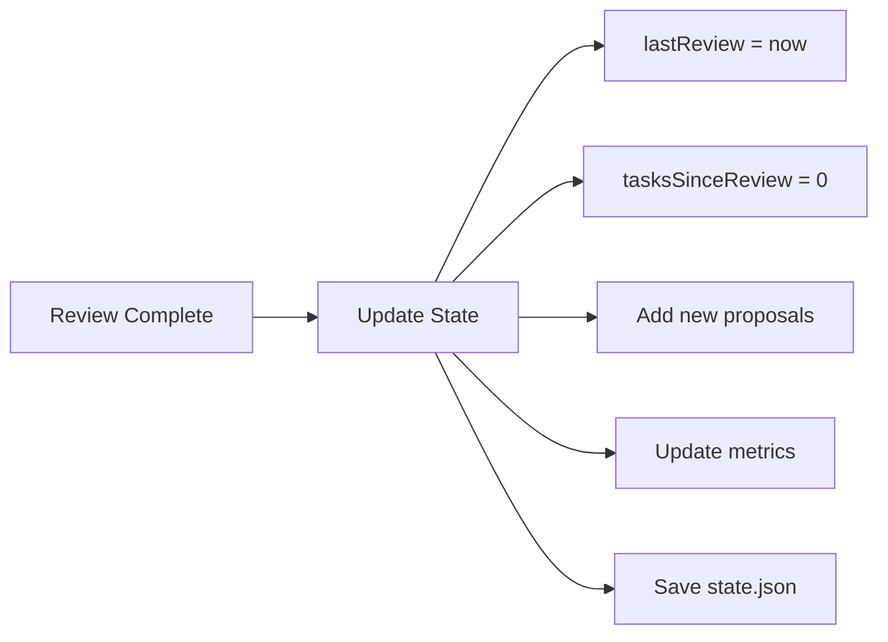
```mermaid
flowchart LR
    Review[Review Complete] --> Update[Update State]

    Update --> LastReview[lastReview = now]
    Update --> TaskCount[tasksSinceReview = 0]
    Update --> Proposals[Add new proposals]
    Update --> Metrics[Update metrics]

    Update --> Save[Save state.json]
```

## Configuration Reference

```yaml
outerLoop:
  triggers:
    afterTasks: 10           # Trigger after N tasks
    schedule: "0 9 * * 1"    # Optional cron schedule

  minOccurrences: 3          # Minimum pattern occurrences
  minConfidence: 0.7         # Minimum confidence (0-1)
  lookbackDays: 30           # Days of logs to analyze
  maxProposals: 5            # Max proposals per review

  learnings:
    maxCount: 50             # Max learnings to keep
    retentionDays: 90        # Days before pruning
    promotionThreshold: 3    # References for promotion
    similarityThreshold: 0.9 # Dedup threshold (0-1)
```

## CLI Usage

```bash
# Run outer loop review (interactive)
ophan review

# Force run even if threshold not reached
ophan review --force

# Auto-approve guideline changes (criteria still need approval)
ophan review --auto

# Skip interactive review, save proposals to pending
ophan review --non-interactive

# Review pending proposals from previous runs
ophan review --pending

# Run on specific project
ophan review --project /path/to/project
```

## Interactive Review

When proposals are generated, the interactive reviewer presents each one:

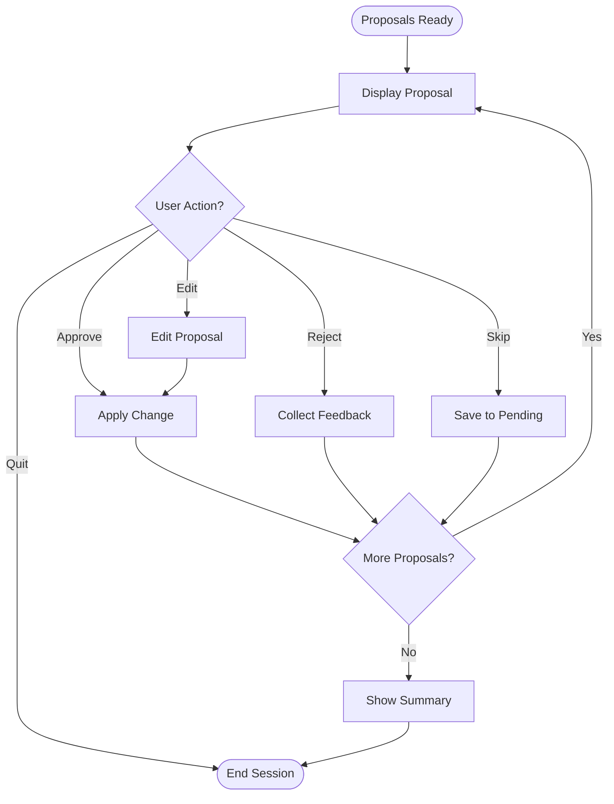
```mermaid
flowchart TB
    Start([Proposals Ready]) --> Display[Display Proposal]
    Display --> Prompt{User Action?}

    Prompt --> |"Approve"| Apply[Apply Change]
    Prompt --> |"Reject"| Feedback[Collect Feedback]
    Prompt --> |"Edit"| Edit[Edit Proposal]
    Prompt --> |"Skip"| Skip[Save to Pending]
    Prompt --> |"Quit"| End([End Session])

    Apply --> Next{More Proposals?}
    Feedback --> Next
    Edit --> Apply
    Skip --> Next

    Next --> |"Yes"| Display
    Next --> |"No"| Summary[Show Summary]
    Summary --> End
```

**Review Actions:**

| Action | Key | Description |
|--------|-----|-------------|
| Approve | `A` | Apply the proposal as-is |
| Reject | `R` | Decline with feedback (for learning) |
| Edit | `E` | Modify the proposal before applying |
| Skip | `S` | Save to pending for later review |
| Quit | `Q` | End review session, remaining saved to pending |

**Review Modes:**

| Mode | Flag | Behavior |
|------|------|----------|
| Interactive | (default) | Review each proposal one by one |
| Auto | `--auto` | Auto-approve guidelines, prompt for criteria |
| Non-Interactive | `--non-interactive` | Skip all, save to pending |

## Context Agent Analysis

The Context Agent analyzes context usage metrics during the outer loop:

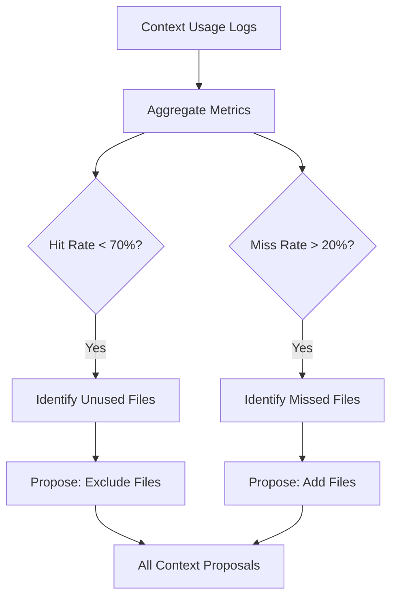
```mermaid
flowchart TB
    Logs[Context Usage Logs] --> Aggregate[Aggregate Metrics]

    Aggregate --> HitRate{Hit Rate < 70%?}
    Aggregate --> MissRate{Miss Rate > 20%?}

    HitRate --> |"Yes"| Unused[Identify Unused Files]
    MissRate --> |"Yes"| Missed[Identify Missed Files]

    Unused --> Proposal1[Propose: Exclude Files]
    Missed --> Proposal2[Propose: Add Files]

    Proposal1 --> AllProposals[All Context Proposals]
    Proposal2 --> AllProposals
```

**Context Metrics:**

| Metric | Target | Action if Failing |
|--------|--------|-------------------|
| Hit Rate | >70% | Propose removing unused files from context |
| Miss Rate | <20% | Propose adding commonly needed files |

View context statistics with:

```bash
ophan context-stats
ophan context-stats --days 7
ophan context-stats --json
```

## Next Steps

- [Architecture Overview](./architecture.md) - System architecture
- [Inner Loop Documentation](./inner-loop.md) - Task execution
- [Configuration Reference](./configuration.md) - Full configuration options
